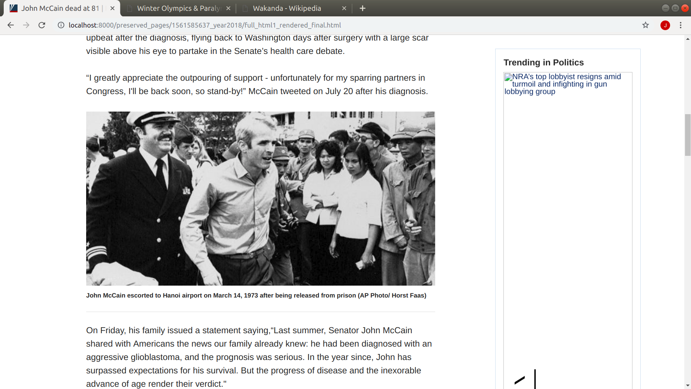
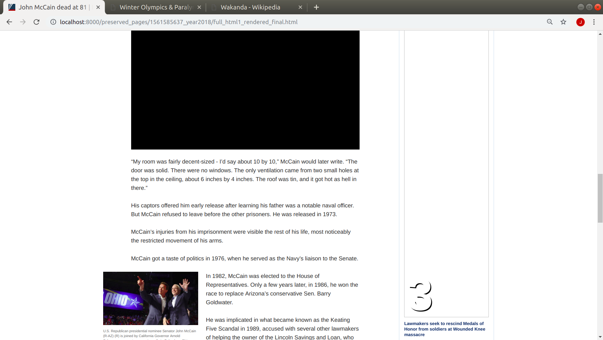
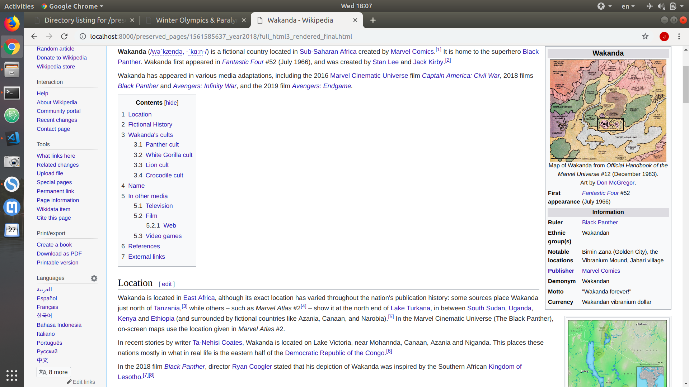

# web-preservation

## Goal
- Preserve webpages, including important resources on them, so that years later, one could perform any analysis on this webpage even if the webpage itself disappears.

## What's new
- How is it different from search engines such as Google?
    - We store not only existing pages, but also pages in the past (probably missing).
    - More than HTMLs are stored, including images/layouts/videos. Images/layout won't be interesting to search engines because their users give text query. But those resources may be missing in the future, while they are important.
- How is it different from [WayBack Machine](https://archive.org/web/) that also stores the past webpages?
    - We only store important image resources (that are related and helpful to the article contents) on a given webpage (determined by our algorithm).
    - We reduce storage overhead, by eliminating redundancy.

## Challenges

## Examples
- In order to preserve the webpages in the **worst** case, in which all the files on the web are missing (not very possible though), the following examples are displayed with Internet turned off, and are hosted on port 8000 locally.
- Some BBC news article: https://www.bbc.com/sport/winter-olympics/48748380

Note that only the important images are preserved. The images in "Top Stories" bar, which serve as a recommendation to readers are declared by our algorithm as unimportant, and thus are not collected.

- Some Fox article: https://www.foxnews.com/politics/john-mccain-dead-at-81

Note that the large black rectangle in the above screenshot is  a video. Currently the videos are not stored. Also only important image is preserved in this case.

- Some Wiki page: https://en.wikipedia.org/wiki/Wakanda

## ChangeLog
- See [ChangeLog](ChangeLog)
