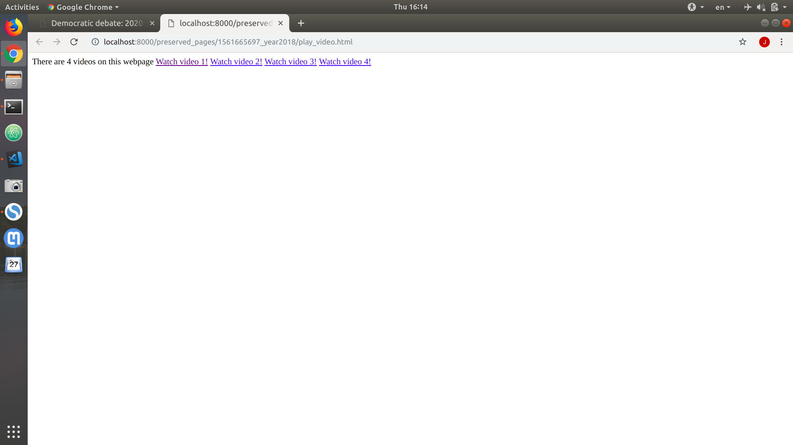

# web-preservation

## Goal
- Preserve webpages, including important resources on them, so that years later, one could perform any analysis on this webpage even if the webpage itself disappears.

## What's new
- How is it different from search engines such as Google?
    - We store not only existing pages, but also pages in the past (probably missing).
    - More than HTMLs are stored, including images/layouts/videos. Images/layout won't be interesting to search engines because their users give text query. But those resources may be missing in the future, while they are important.
- How is it different from [WayBack Machine](https://archive.org/web/) that also stores the past webpages?
    - We only store important image resources (that are related and helpful to the article contents) on a given webpage (determined by our algorithm).
    - We reduce storage overhead, by eliminating redundancy.

## Challenges

## (Very Experimental) Features
### Video Preservation (unstable, experimental)
- Currently for popular websites, the videos on their webpages **may** be able to be preserved. 
- The followoing is one example of BBC article that contains 4 videos: https://www.bbc.com/news/world-us-canada-48781165
- Note that on the left-top corner, I added a note that there are videos on this webpage, but since the video player won't work without Internet, the videos are preserved somewhere other than being played directly on this page. In the following screenshot, the grey box with a Chrome dinosour is one video.

- If the reader is interested in the videos on that webpage, she/he may click the note on top-left corner, which links to the list of videos.

- Finally, she/he can watch any videos as she/he wants by clicking it! Note that the above runs without Internet connection, so years later though the webpage and videos could have disappeared, one can still watch it if it is preserved here.

## Examples
- In order to preserve the webpages in the **worst** case, in which all the files on the web are missing (not very possible though), the following examples are displayed with Internet turned off, and are hosted on port 8000 locally.
- Some BBC news article: https://www.bbc.com/sport/winter-olympics/48748380

Note that only the important images are preserved. The images in "Top Stories" bar, which serve as a recommendation to readers, are declared by our algorithm as unimportant, and thus are not collected.

<!-- - Some Fox article: https://www.foxnews.com/politics/john-mccain-dead-at-81

Note that the large black rectangle in the above screenshot is  a video. Currently the videos are not stored. Also only important image is preserved in this case. -->

- Some Wiki page: https://en.wikipedia.org/wiki/Wakanda

## ChangeLog
- See [ChangeLog](ChangeLog)
